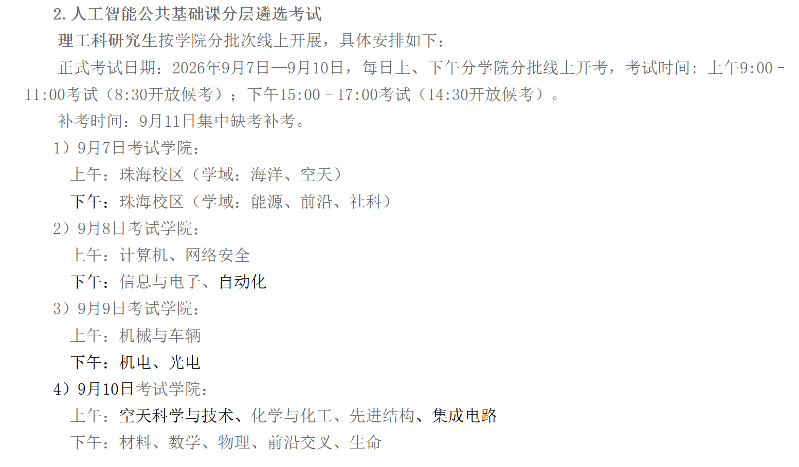

# 百丽宫 2026 级研究生人工智能公共基础课分层考试资料

本仓库面向百丽宫 2026 级研究生人工智能公共基础课分层遴选考试，整理官方样题、不同考试批次的真实考题回忆版、参考答案、课程实验与官方资料，方便考前快速定位题型、考点和 PyTorch 编程易错项。

> **考试复习最重要的两个入口：本 README 与 [《人工智能公共基础分层考试样例及参考答案》PDF](./【汇总】人工智能公共基础分层考试样例及参考答案.pdf)。** 需要编辑、补充或打印时，可使用同内容的 [DOCX 版本](./【汇总】人工智能公共基础分层考试样例及参考答案.docx)。

## 资料来源与仓库定位

本仓库的公开整理受到 [SSYH1896/BIT-AI-Layered-Exam-Course-Materials](https://github.com/SSYH1896/BIT-AI-Layered-Exam-Course-Materials) 启发；如需更全面的官网导出文件，可直接查看其 [官方资料导出目录](https://github.com/SSYH1896/BIT-AI-Layered-Exam-Course-Materials/tree/main/%E5%AE%98%E6%96%B9%E8%B5%84%E6%96%99%E5%AF%BC%E5%87%BA)。

两个仓库的主要区别是：前者侧重依据课程视频整理笔记并编写模拟卷，本仓库侧重汇总不同批次考生对**已经实际考过的题目**所作的回忆，并补充参考答案与得分要点，属于真题回忆而非模拟卷。

考试课程和学习资料来自 [人工智能公共基础课分层考试网站](https://bit.thefront.cn/)。本仓库为非官方学习整理，考试安排、题目要求和最终解释均以学校及考试网站的最新通知为准。

## 仓库内容

```text
.
├─ README.md
├─ 考试安排.png
├─ 【汇总】人工智能公共基础分层考试样例及参考答案.pdf
├─ 【汇总】人工智能公共基础分层考试样例及参考答案.docx
├─ 官网文件
│  ├─ 考试须知.pdf
│  └─ 《人工智能导论》.pdf
└─ 课程内容+课后作业
   ├─ 1-人工智能概述
   ├─ 2-深度学习
   ├─ 3-自然语言处理
   ├─ 4-大语言模型
   ├─ 5-计算机视觉
   ├─ 6-多模态大模型与具身智能
   ├─ 7-人工智能与认知计算
   ├─ 8-智能体与角色扮演
   ├─ 9-量子计算与人工智能
   ├─ 10-人工智能安全与伦理
   └─ 人工智能通识课_课程笔记【没啥用感觉】.pdf
```

- **汇总资料**：含 1 套官网唯一参考样题和 4 套不同批次的真实考题回忆版，共 5 套；每套均整理了题目、参考答案、得分要点及编程题代码。
- **课程内容与课后作业**：保留 10 门课的目录、课后任务和实验复现；视频文件体积较大，本仓库不上传。
- **个人课程笔记**：看完课程视频后的个人总结，仅作辅助，考前优先级低于真题汇总。
- **官网文件**：课程相关教材与考试须知。

## 考试安排

具体学院批次见 [考试安排.png](./考试安排.png)：正式考试为 **2026 年 9 月 7 日至 9 月 10 日**，每天按学院分上午、下午线上开考；上午 **9:00–11:00**（8:30 开放候考），下午 **15:00–17:00**（14:30 开放候考），**9 月 11 日**集中缺考补考。



## 考试题型结构

依据官网样题及四套考题回忆版，试卷结构高度稳定：

| 题号 | 题型 | 数量 | 常见内容 | 建议时间 |
| --- | --- | ---: | --- | ---: |
| 1–3 | 基础问答题 | 3 | AI 基础概念、神经网络与深度学习、NLP/文本处理 | 约 10 分钟/题 |
| 4–6 | 前沿与应用问答题 | 3 | 大模型、Agent、多模态/具身智能、视觉、安全伦理 | 约 15 分钟/题 |
| 7 | 编程改错题 | 1 | PyTorch 训练/推理模式、梯度、数据泄露、维度错误 | 约 20 分钟 |
| 8 | 编程理解或补全题 | 1 | CNN/RNN/MLP 结构、张量维度、指标公式、推理代码 | 约 25 分钟 |

共 8 题、考试时长 120 分钟；常见分值结构为前 6 道问答题约占 80%，后 2 道编程题约占 20%。官网样题的问答题通常建议作答 200～300 字，回忆题的具体字数要求可能不同，应以考试页面当场提示为准。

## 考题考察重点

题目通常不要求长篇背诵，更重视以下能力：

1. **概念讲准确**：先下定义，再说输入、处理过程、输出与边界。
2. **机制讲清楚**：不能只写术语，要说明为何有效、何时失效。
3. **比较有维度**：从目标、输入输出、粒度、成本、风险和适用场景对比。
4. **案例形成闭环**：任务目标 → 数据/感知 → 模型处理 → 结果/行动 → 反馈与风险。
5. **问题可诊断**：从数据、模型、训练、评估、部署环境逐层排查。
6. **风险有措施**：写清风险来源、可能后果、检测办法和控制机制。
7. **代码懂状态与维度**：能判断模型模式、梯度、设备、张量形状和数据划分是否正确。

## 高频核心知识点

下表按 1 套官网样题与 4 套真实考题回忆版的题目主旨作粗略统计；“覆盖套数”表示该主题至少在该套试题的一道题中出现，存在一道题同时覆盖多个主题的情况。

| 优先级 | 覆盖套数 | 高频主题 | 必会关键词与答题抓手 |
| ---: | :---: | --- | --- |
| 1 | 5/5 | 神经网络、深度学习与 PyTorch | 神经元、权重、激活、loss；前向传播 → 损失 → 反向传播 → 参数更新；CNN/RNN/MLP/Transformer；张量维度；训练与验证曲线排查；`model.train()`、`optimizer.zero_grad()`、`loss.backward()`、`optimizer.step()` |
| 2 | 5/5 | AI 概念、能力与可靠性 | 弱/强/超人工智能；预测正确 ≠ 真正理解；图灵测试局限；相关 ≠ 因果；测试性能 ≠ 部署稳定；证据、适用条件、不确定性、人工复核 |
| 3 | 5/5 | 安全、伦理、偏见与局限 | 幻觉、隐私、公平、责任；数据投毒、对抗样本、提示注入、越狱、工具越权；威胁建模、红队测试、最小权限、二次确认、日志审计、拒绝/降级/回滚；总体指标与群体指标同时报告 |
| 4 | 5/5 | 计算机视觉 | 像素、RGB、分辨率；分类 = 类别，检测 = 类别 + 边界框，分割 = 像素级掩码；生成式模型输出新图像；卷积/池化尺寸；分辨率边长翻倍时像素约 4 倍，ViT 全局注意力成本可能约 16 倍 |
| 5 | 5/5 | NLP、大模型与知识增强 | 文本清洗 → 分词/token → ID → embedding → 位置编码 → 编码/注意力 → 任务头/解码；歧义、上下文、常识；文本分类与信息提取；长上下文 vs RAG；幻觉及证据溯源 |
| 6 | 4/5 | 多模态与具身智能 | 文本/图像/语音/传感器；时间、空间、语义对齐；早期/中期/晚期融合；来源可靠性、置信度校准、冲突分级；具身闭环：感知 → 理解 → 规划 → 运动 → 反馈 |
| 7 | 3/5 | Agent、角色扮演与工具调用 | 目标 → 规划 → 工具执行 → 观察 → 调整；普通聊天模型不直接改变外部世界；Prompt 快但约束弱，微调稳定但成本高，Skills 可组合、可调用工具但需权限治理 |
| 8 | 3/5 | 数据质量与评估设计 | 数量不等于质量；代表性、覆盖度、标签质量、类别平衡、分布漂移；先划分再拟合预处理器，防止测试集信息泄露；独立测试集、外部验证、分群评估 |
| 9 | 2/5 | Precision、Recall 与 F1 | 混淆矩阵 TP/TN/FP/FN；Precision 关注误报，Recall 关注漏报；资源有限时根据误报/漏报代价调阈值；F1 平衡二者 |

### PyTorch 编程必背

| 场景 | 正确写法 | 作用与常见错误 |
| --- | --- | --- |
| 开始训练 | `model.train()` | 启用 Dropout 的随机丢弃；BatchNorm 使用当前批次统计并更新运行统计。遗漏时可能继续处于评估模式。 |
| 每批训练前 | `optimizer.zero_grad()` | 清空旧梯度；PyTorch 默认累积梯度，遗漏会把多个 batch 的梯度叠加。 |
| 反向与更新 | `loss.backward()` → `optimizer.step()` | 先计算梯度，再由优化器更新参数；顺序不能反。 |
| 开始推理 | `model.eval()` | 关闭 Dropout 随机性；BatchNorm 改用训练期累计的统计量。它**不会**关闭梯度。 |
| 关闭梯度 | `with torch.no_grad():` | 不构建反向图，减少显存与计算；它**不会**自动切换 Dropout/BatchNorm 模式。 |
| 设备一致 | `model.to(device)`、`x = x.to(device)`、`y = y.to(device)` | 模型、输入和标签必须在同一 CPU/GPU 设备，否则会报设备不一致错误。 |
| 推理后续训 | `model.train()` | 测试完成后恢复训练行为。 |

标准训练循环：

```python
model.train()
for x, y in train_loader:
    x, y = x.to(device), y.to(device)
    optimizer.zero_grad()
    outputs = model(x)
    loss = criterion(outputs, y)
    loss.backward()
    optimizer.step()
```

标准推理循环：

```python
model.eval()
correct = total = 0
with torch.no_grad():
    for x, y in test_loader:
        x, y = x.to(device), y.to(device)
        outputs = model(x)
        predicted = outputs.argmax(dim=1)
        total += y.size(0)
        correct += (predicted == y).sum().item()
accuracy = correct / total
```

### Precision、Recall 与 F1

```text
Precision = TP / (TP + FP)
Recall    = TP / (TP + FN)
F1        = 2 × Precision × Recall / (Precision + Recall)
          = 2TP / (2TP + FP + FN)
```

- **Precision（精确率）**：被判为正的样本中有多少是真的，重点控制误报 FP。
- **Recall（召回率）**：所有真实正例中有多少被检出，重点控制漏报 FN。
- **取舍**：疾病筛查、安全告警等漏报代价高的场景优先 Recall；人工复核资源紧张、误报代价高时优先 Precision；阈值选择应结合业务成本，而非机械追求单个指标最高。

### Transformer 与现代语言模型

```text
文本 → token 化 → token embedding + 位置编码
     → 多头自注意力（Q/K/V）→ 前馈网络
     → 残差连接 + LayerNorm → 多层堆叠 → 任务输出
```

- **自注意力**：用 Query 与 Key 的相似度形成权重，再对 Value 加权汇总，使每个 token 能利用上下文并建立长距离依赖。
- **多头机制**：在不同表示子空间并行学习语义、句法、指代等关系。
- **位置编码**：弥补注意力本身不含顺序的问题。
- **生成式语言模型**：通常使用因果掩码，只看当前位置之前的信息并进行下一 token 预测。
- **幻觉**：输出流畅可信但事实错误、无法核验或与材料矛盾；原因包括概率生成目标、训练数据错误或过时、提示含糊、知识不足。可用 RAG、来源引用、工具核验、置信度表达和人工审核缓解。

### 长上下文与 RAG

| 维度 | 长文本直接放入上下文 | RAG |
| --- | --- | --- |
| 信息流程 | 完整资料随问题直接进入模型 | 资料先切分、索引，提问时检索少量相关片段再生成 |
| Token 与成本 | 随全文长度增长 | 通常只消耗检索片段的 token |
| 信息干扰 | 长文本容易稀释重点、出现“中间信息丢失” | 依赖检索质量，可能漏掉关键片段 |
| 更新方式 | 每次重新提供新全文 | 更新外部知识库或索引，无需重新训练模型 |
| 证据溯源 | 原文虽在上下文中，但引用定位未必稳定 | 可返回文档、页码或片段来源，便于复核 |

上下文窗口变长不会完全替代 RAG，因为企业知识库会持续更新且规模远超单次窗口，RAG 仍能降低 token 成本与噪声、实施访问控制、提供可核验证据并支持快速更新。

### 多模态、对齐与冲突处理

1. **对齐**：先统一时间戳、坐标系、单位、对象身份和语义，使不同模态描述同一事件。
2. **融合**：可在输入层、特征层或决策层联合文本、图像、语音及传感器信息。
3. **冲突处理**：检查错位 → 评估来源历史可靠性、设备状态和时效 → 校准置信度 → 按可靠性加权或舍弃异常源。
4. **风险分级**：低风险选择更新且可信的来源；中风险重新采样或请求额外模态；高风险暂停决策、转人工并保留日志。
5. **质量评估**：分别报告单模态、缺失模态、冲突样本、分布外样本和不同群体的指标。

## 复习与答题建议

1. 第一优先级阅读本 README 的高频表和汇总 PDF 中的 5 套题，特别是每题后的“关键得分点”。
2. 把定义题练成统一结构：**定义 → 机制/流程 → 案例 → 局限/风险 → 改进**。
3. 为推荐系统、医疗诊断、自动驾驶、差旅 Agent 各准备一个可迁移案例。
4. 手写一遍训练循环和推理循环，确保会解释 `train/eval`、`zero_grad/no_grad` 与 `.to(device)` 的不同职责。
5. 掌握 CNN 两次池化后的尺寸、RNN 最后时间步、MLP 相邻层输入输出维度。
6. 考试时先读小问和提示，按点作答；代码题优先检查模式、梯度、设备、维度、数据划分和指标分母。

## 教学课程大纲

课程目录保留了全部 10 门课的名称。视频未上传；表中“仓库内资料”仅列当前可用的非视频内容。

| 课次 | 课程 | 授课教师 | 主要内容 | 仓库内资料 |
| ---: | --- | --- | --- | --- |
| 1 | 人工智能概述 | 张华平 | AI 概念、发展、能力边界与基础实践 | MNIST 的 MLP/Transformer 实验、数据集和配图 |
| 2 | 深度学习 | 李秋池 | 神经网络、训练流程、优化与评估 | 保留课程目录 |
| 3 | 自然语言处理 | 张华平 | 文本表示、分类、信息提取与语言理解 | 课后任务 |
| 4 | 大语言模型 | 张华平 | Transformer、生成机制、对齐、RAG 与幻觉 | 保留课程目录 |
| 5 | 计算机视觉 | 李磊 | 图像分类、目标检测、分割与视觉模型 | YOLOv10 代码资料、视频检测 Notebook、课后作业 |
| 6 | 多模态大模型与具身智能 | 李磊 | 跨模态对齐融合、视觉语言模型、感知与行动闭环 | GroundingDINO 教程 Notebook、作业说明与示例图 |
| 7 | 人工智能与认知计算 | 张宝华 | 智能、认知、理解与推理 | 保留课程目录 |
| 8 | 智能体与角色扮演 | 张宝华 | Agent 规划、工具调用、反馈与角色构建 | 课后作业 |
| 9 | 量子计算与人工智能 | 李秋池 | 量子计算基础及其与 AI 的结合 | 量子课程 Notebook、课后作业 |
| 10 | 人工智能安全与伦理 | 李秋池 | 安全威胁、隐私、公平、责任与治理 | 课后作业 |

## 免责声明

- 本仓库仅用于学习与交流，不是北京理工大学官方发布渠道。
- 回忆版题目由考生根据考后记忆整理，措辞可能与正式试题不同；参考答案也不是官方标准答案。
- 请遵守考试纪律、课程平台规则及相关资料的版权要求；如涉及权益问题，请联系仓库维护者处理。

